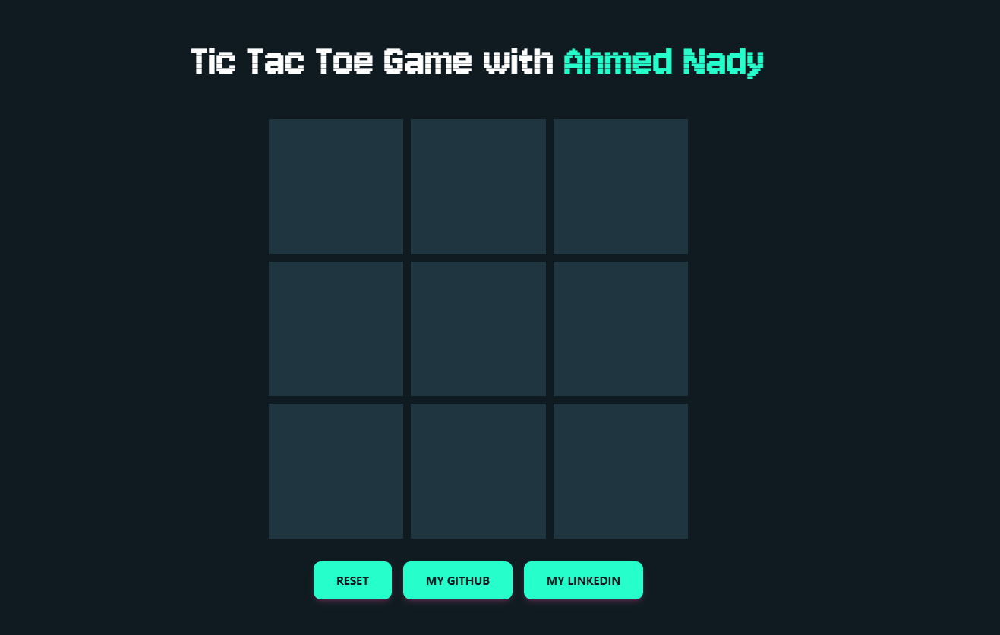
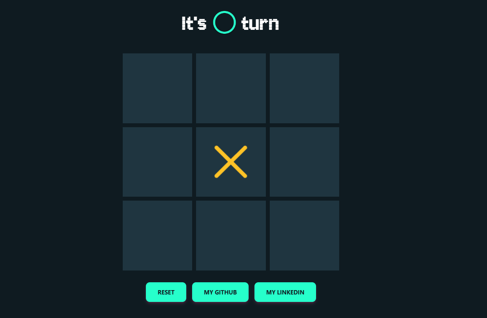
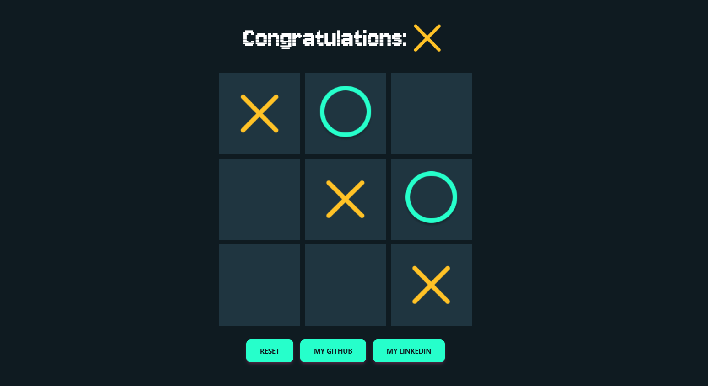

# Tic Tac Toe Game

A simple Tic Tac Toe game built with React and styled using Tailwind CSS. This project demonstrates the usage of state management, event handling, and responsive design.

 
 
 

## Project Overview

This project is a classic Tic Tac Toe game where players can alternate between 'X' and 'O'. The game includes features to determine the winner and provides a reset button to start a new game. The user interface is designed to be responsive and visually appealing using Tailwind CSS.

## Technologies Used

- **React**: A JavaScript library for building user interfaces.
- **Tailwind CSS**: A utility-first CSS framework for creating custom designs quickly.

## Features

- **Game Play**: Players can click on cells to place their 'X' or 'O'.
- **Winner Detection**: The game checks for a winning combination or a tie.
- **Responsive Design**: The game is styled using Tailwind CSS to ensure it looks good on different devices.
- **Reset Functionality**: Allows players to restart the game.

## Installation

To get started with this project, follow these steps:

## Installation

To set up the project locally, follow these steps:

1. **Clone the repository**:
   ```bash
   git clone https://github.com/Ahmed-Nadyy/Tic-Tac-Toe-Game-in-React.git

2. **Navigate to the project directory**:
   ```bash
   cd Tic-Tac-Toe-Game-in-React

3. **Install dependencies**:
   ```bash
   npm install

4. **Start the development server**:
   ```bash
   npm start

5. **Open the application**:
   ```bash
   Open your browser and navigate to `http://localhost:3000`.

## Usage

1. **Play the Game**: Click on the cells to place 'X' or 'O'. The game will automatically detect a winner or a tie.
2. **Reset the Game**: Click the "Reset" button to start a new game.

## Contributing

Contributions to the Movie Application are welcome! If you'd like to contribute, please follow these steps:

1. **Fork the repository.**
2. **Create a new branch for your feature or bug fix.**
3. **Commit your changes and push to your fork.**
4. **Open a pull request with a detailed description of your changes.**

## Contact

For any questions or feedback, please reach out to [nadyahmd88@gmail.com](mailto:nadyahmd88@gmail.com).